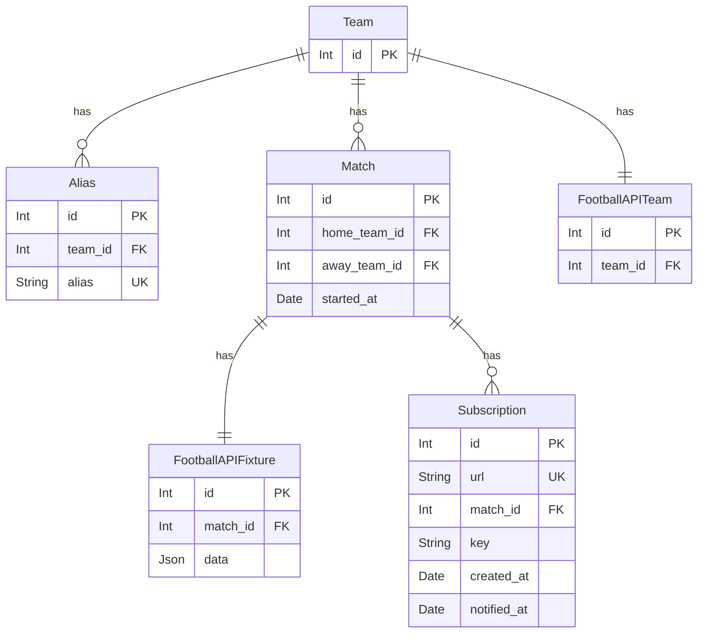
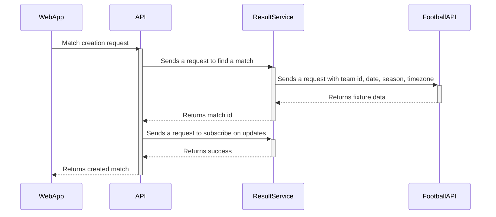
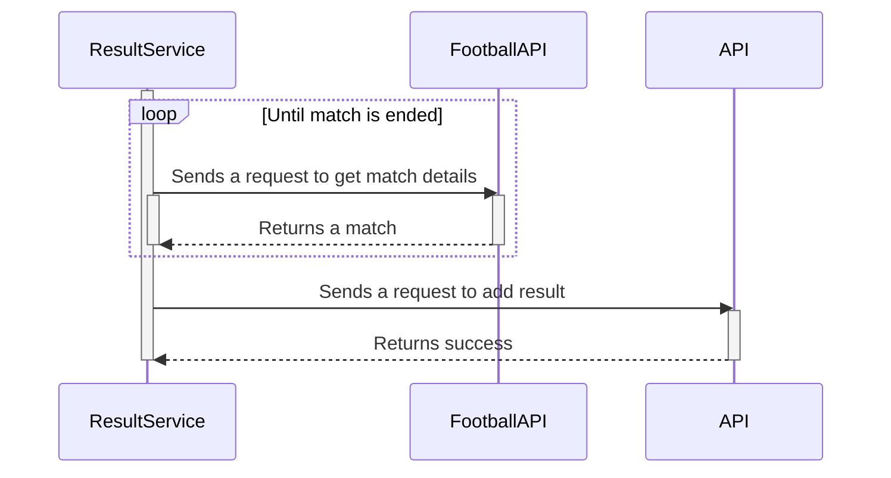
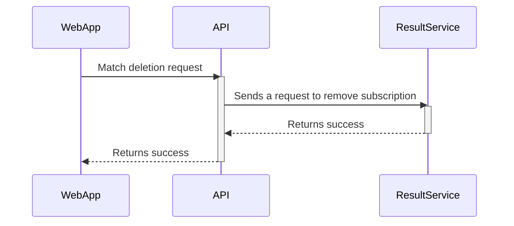

# football-result-service

## General Info

The purpose of this service is to make the life of administrators of football sites easier. 
Instead of monitoring football matches and adding results manually, their apps can use the webhook to receive results automatically.
`football-result-service` is created for **prognoz** project ([web-app](https://github.com/andrewshostak/prognoz_web_app), [api](https://github.com/andrewshostak/prognoz_api)), but not restricted to only it. 
Feel free to use this service for your needs.

## Technical implementation

### Characters

(Integration with `prognoz` project as an example)

- Football Result Service / `result-service` - This service.
- Football Results API / `football-api` - The source of the football matches results: [documentation](https://www.api-football.com/documentation-v3).
- Prognoz API Server / `prognoz-api` - The service which wants to receive the results.
- Prognoz Web Application / `web-app` - The client app of the `prognoz-api` through which administrators manage football matches data. 

### Data persistence

`result-service` has a **relational database**. It is visually represented below:

Table names are pluralized. The tables `teams`, `aliases`, `football_api_teams` are pre-filled with the data of `prognoz-api` and `football-api`.

### Subscribe on result adding
When `prognoz-api` receives a request to create a match, the next actions will happen:
1) `prognoz-api` gets both clubs from DB
2) `prognoz-api` sends a request to `result-service` to create a scheduled job with the next payload:  
Starting date `started_at` of the `match`, home `club` `link`, away `club` `link`.
3) `result-service` receives a request and performs a search in `aliases` table
4) `result-service` sends a request to `football-api` with `team` (`footbal_api_team_id`), `date` (only date from `started_at` datetime), `season`, `timezone` (both fields are set during the service initialization)
5) `football-api` returns a fixtures array with one element having id in it.
6) `result-serice` creates a new `match` and `football_api_fixture` in the database.
7) `result-serice` returns a `match_id` in the response.

When `prognoz-api` receives a request from `result-service`, the next actions will happen:
1) `prognoz-api` saves the payload from `web-app` in database.
2) having `match_id` from the response, `prognoz-api` sends a second request to `result-service` to create a subscription.
3) the subscription create request has next payload: `url`, `match_id`
4) `result-service` saves the subscription in database and schedules a job.

### Get and add a match result

1) the new endpoint will be created in `prognoz-api`, especially for adding a result. 
2) the scheduled job will send a http request to `football-api` to get a fixture data by id. Scheduled job spec:
- the scheduled job in `result-service` will start 100 minutes after the match starting date.
- if the fixture status is not `FT`, `result-service` will send more requests to `football-api`, until receives the `FT` status.
- the interval between calls to `football-api` is next (minutes from match start): 100 (initial), 30, 20, 120, 120.
- max number of retries is 5.
3) `result-service` updates the fixture in database after each call to `football-api`.
4) `result-service` iterates over all subscriptions with particular `match_id` and sends a request to `url`.

### Delete a match

1) `prognoz-api` gets both clubs from DB
2) `prognoz-api` sends a request to `result-service` to delete a subscription job with the next payload:  
   Starting date `started_at` of the `match`, home `club` `link`, away `club` `link`.
3) `result-service` receives a request and performs a search in `aliases`, `teams`, `matches` table
4) `result-service` finds a `match` `id` and removes a subscription.
5) if there is no more subscriptions `result-service` cancels scheduled job and removes `match` and `football_api_fixture`

### Update match

#### Update match teams

TODO

#### Update match time

TODO

### Authorization

`prognoz-api` => `result-service`
1) A secret key is generated, hashed and set to env variables
2) `prognoz-api` attaches secret key to requests to `result-service`
3) `result-service` has a middleware that checks presence and validity of secret-key

`result-service` => `prognoz-api`
1) When `prognoz-api` creates a subscription it sends a secret-key
2) Secret-key is saved in `subscriptions` table for each subscription  
3) When `result-service` calls subscription `url` it attaches secret-key to the request

`result-service` => `football-api`
1) An env variable `RAPID_API_KEY` is stored in env variables and attached to each request 

### cronjob package requirements:
  - Save params during its lifetime: fixture_id, match_id, start time.
  - set starting time (100 minutes since match start)
  - frequency (every 10 minutes, if possible 5-10-20-40)
  - ability to stop (when result is present)
  - ability to cancel cronjob if match was deleted or updated
- when cronjob in `result-service` receives result, it sends a request to `prognoz-api` endpoint to add result.

### Service initialization
- get unfinished jobs and reschedule them

cron packages list:
[chrono](https://github.com/procyon-projects/chrono)
https://github.com/gocraft/work
https://github.com/hibiken/asynq

### Open questions

4) What should be fulfilled during result-service initialization?   
- football api healthcheck? (TODO: do they even have healthcheck)

