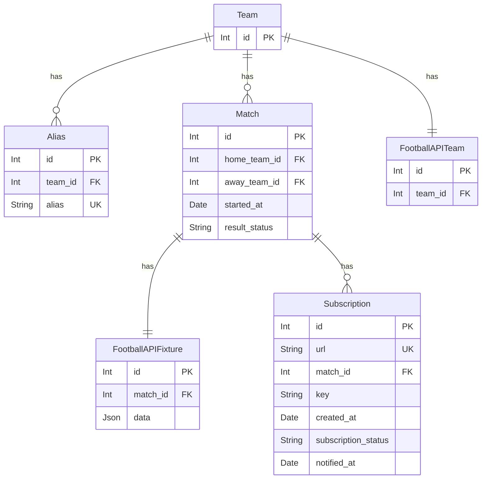
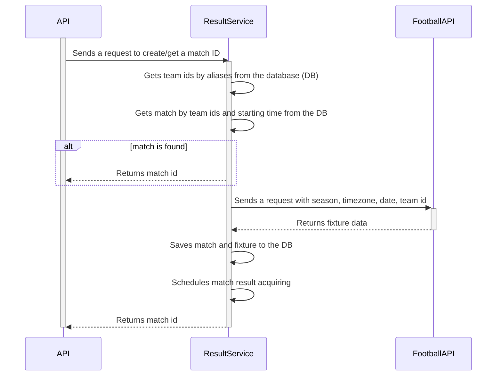
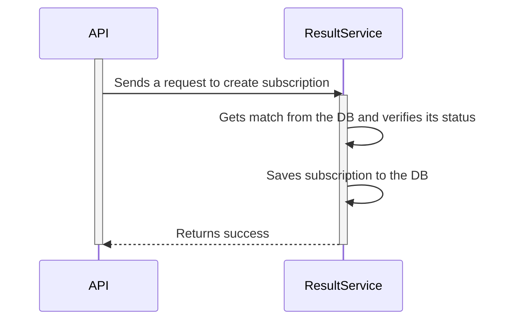
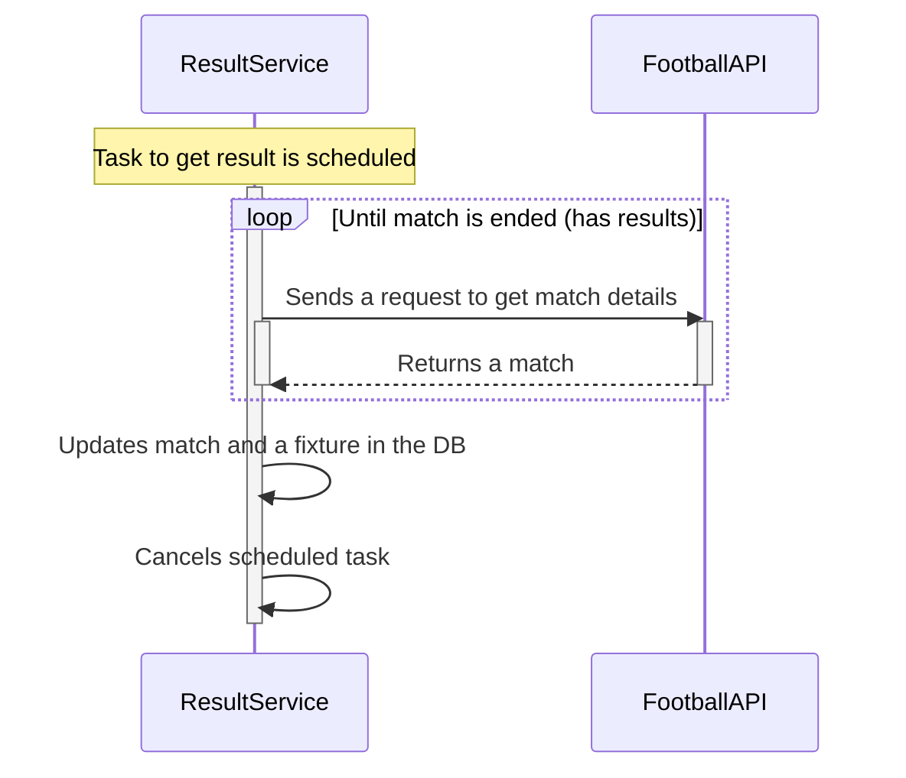
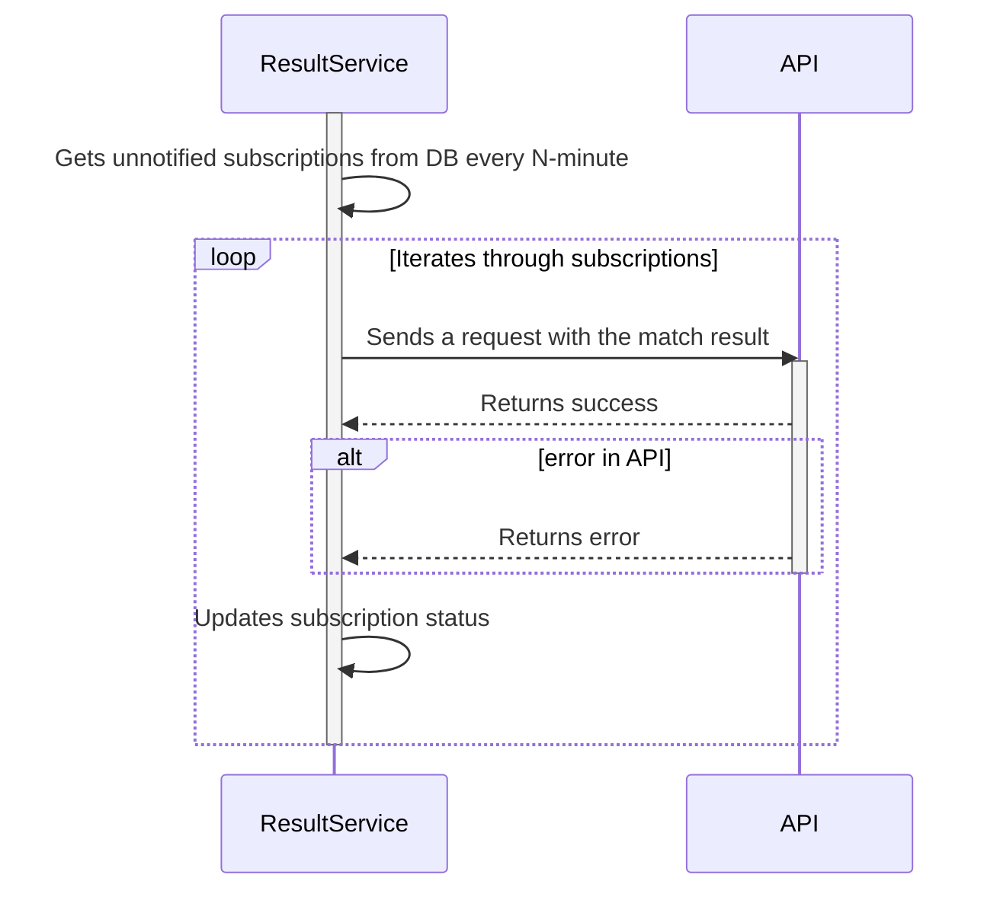
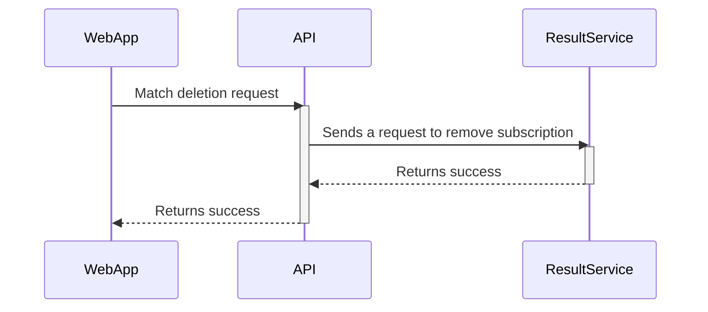

# football-result-service

## General Info

The purpose of this service is to make the life of administrators of football sites easier. 
Instead of monitoring football matches and adding results manually, their apps can use the webhook to receive results automatically.
`result-service` is created for **prognoz** project ([web-app](https://github.com/andrewshostak/prognoz_web_app), [api](https://github.com/andrewshostak/prognoz_api)), but not restricted to only it. 
Feel free to use this service for your needs.

## Technical implementation

### Characters

(Integration with `prognoz` project as an example)

- Football Result Service / `result-service` - This service.
- Football Results API / `football-api` - The source of the football matches results: [documentation](https://www.api-football.com/documentation-v3).
- Prognoz API Server / `prognoz-api` - The service which wants to receive the results.
- Prognoz Web Application / `web-app` - The client app of the `prognoz-api` through which administrators manage football matches data. 

### Data persistence

`result-service` has a **relational database**. It is visually represented below:

Table names are pluralized. The tables `teams`, `aliases`, `football_api_teams` are pre-filled with the data of `prognoz-api` and `football-api`.

### Create or get a match ID

When `prognoz-api` receives a request to create a match, the next actions happen:
1) `prognoz-api` gets both clubs from DB
2) `prognoz-api` sends a request to `result-service` with the next payload:  
   Starting date (`started_at`) of the `match`, home `club` `link`, away `club` `link`.
3) `result-service` receives a request and performs a search in `aliases` table
4) `result-service` does a search in `matches` table. If match exists, the service returns `match_id`, and skips all following steps.
5) `result-service` sends a request to `football-api` with `team` (`footbal_api_team_id`), `date` (only date from `started_at` datetime), `season`, `timezone`
6) `football-api` returns a fixtures array with one element having id in it.
7) `result-service` creates a new `match` and `football_api_fixture` in the database.
8) `result-service` schedules a job to get the result
9) `result-service` returns a `match_id` in the response.

### Subscribe on result receiving
Context: `prognoz-api` has `match_id` from the response of above request.
1) `prognoz-api` sends a second request to `result-service` to create a subscription with the next payload: `match_id`, `url`, `secret_key`
2) `result-service` gets match from the DB and validates its status 
3) `result-service` creates a subscription in the DB
4) `result-service` returns successful empty response

### Get match result

1) the scheduled task sends a request to `football-api` to get a fixture data by fixture id. Scheduled job spec:
- the scheduled task in `result-service` starts in 115 minutes after the match starting date.
- if the fixture status is not finished, `result-service` will send more requests to `football-api`, until receives the finished status.
- the interval between calls to `football-api` is 15 minutes.
- max number of retries is 5.
2) when `result-service` receives ended match it cancels scheduled task and updates fixture/match in the DB
3) when max number of retries reached it updates match status in the DB to `error`

### Notify subscribers

1) `result-service` polls database every 1 minute to get unnotified subscriptions of ended matches.
2) `result-service` iterates through subscriptions and notifies them by making an HTTP-call to a URL
3) depending on successfulness of HTTP-call `result-service` updates subscription status

### Delete a match

1) `prognoz-api` gets both clubs from DB
2) `prognoz-api` sends a request to `result-service` to delete a subscription job with the next payload:  
   Starting date `started_at` of the `match`, home `club` `link`, away `club` `link`.
3) `result-service` receives a request and performs a search in `aliases`, `teams`, `matches` table
4) `result-service` finds a `match` `id` and removes a subscription.
5) if there is no more subscriptions `result-service` cancels scheduled job and removes `match` and `football_api_fixture`

### Update match

#### Update match teams

TODO

#### Update match time

##### Time update to the same date
##### Time update to another date

TODO

### Authorization

`prognoz-api` => `result-service`
1) A secret key is generated, hashed and set to env variables
2) `prognoz-api` attaches secret key to requests to `result-service`
3) `result-service` has a middleware that checks presence and validity of secret-key

`result-service` => `prognoz-api`
1) When `prognoz-api` creates a subscription it sends a secret-key
2) Secret-key is saved in `subscriptions` table for each subscription  
3) When `result-service` calls subscription `url` it attaches secret-key to the request

`result-service` => `football-api`
1) An env variable `RAPID_API_KEY` is stored in env variables and attached to each request 

### Back-fill aliases data

To back-fill aliases data a separate command is created. The command description:
- Gets current season
- Command has predefined list of league and country names (for example: Premier League - Ukraine, La Liga - Spain, etc.)
- Calls `football-api`s `leagues` endpoint with `season` param
- Extracts appropriate league ids from the response of `league` endpoint
- Concurrently calls `teams` endpoint with the `season` and `league` param
- For each team the command does the next actions in database 
  - checks if `alias` already exists
  - if not, creates a `team`, `alias`, `football_api_team` in transaction

### List of improvements
- ✓ move durations to env vars
- fix concurrent map reads/writes
- graceful shutdown
- ✓ replace `fmt.Printf` with good logger
- make gin and zerolog friends
- get two aliases on match creation endpoint concurrently
- notify subscribers concurrently
- create match and football api fixture in transaction
- fix broken gorm errors checks
- update football api fixture and match in transaction
- add response bodies from API calls to error messages
- configure ci
- add unit tests for services: 
  - match
    - Create
    - ✓ List
    - ScheduleMatchResultAcquiring
    - Update
  - notifier
    - NotifySubscribers
  - subscription
    - Create
    - Delete
- add linter
- upgrade go version to 1.21
- use generics for football api client responses

